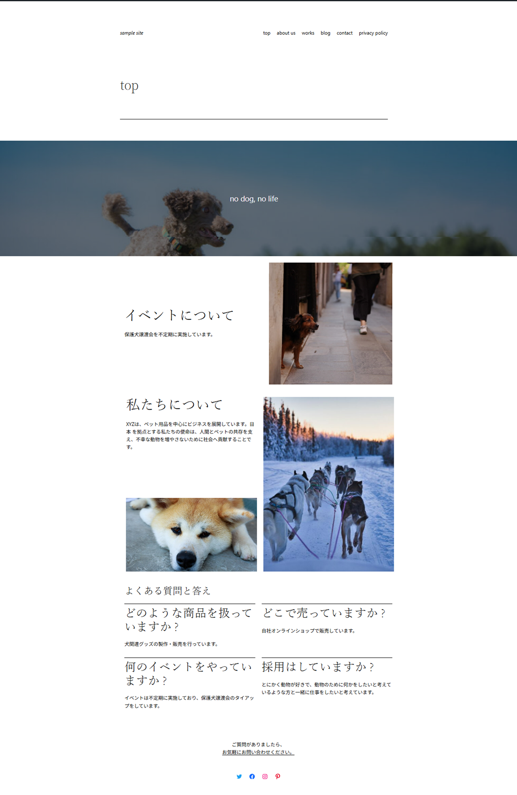

# gy-works.github.io
# 私のポートフォリオ

このリポジトリでは、学習中に作成したWebサイトやアプリをまとめています。

## 🔗 公開サイト
[ポートフォリオサイトはこちら](https://gy-works.github.io/)

## 📁 収録作品

### ① WordPressサイト（Sample Site）
WordPressのLocalで作成したサンプルサイトです。トップページや投稿ページなどをスクリーンショットで一部紹介しています。

（疑似的に作成していますので、内容に意味はありません）

※ローカル環境で作成しているためデモページはございません。

---

### ② パスワード生成アプリ
HTML/CSS/JavaScriptで作成した簡易アプリです。  
[デモページを見る](https://gy-works.github.io/password/)

---

### ③ 日本語クイズアプリ
HTML/Javascriptで作成した日本語の使い方に関する3択クイズです。  
[デモページを見る](https://gy-works.github.io/quiz/)

---

## 💬 補足

このポートフォリオはGitHub Pagesで公開しています。
